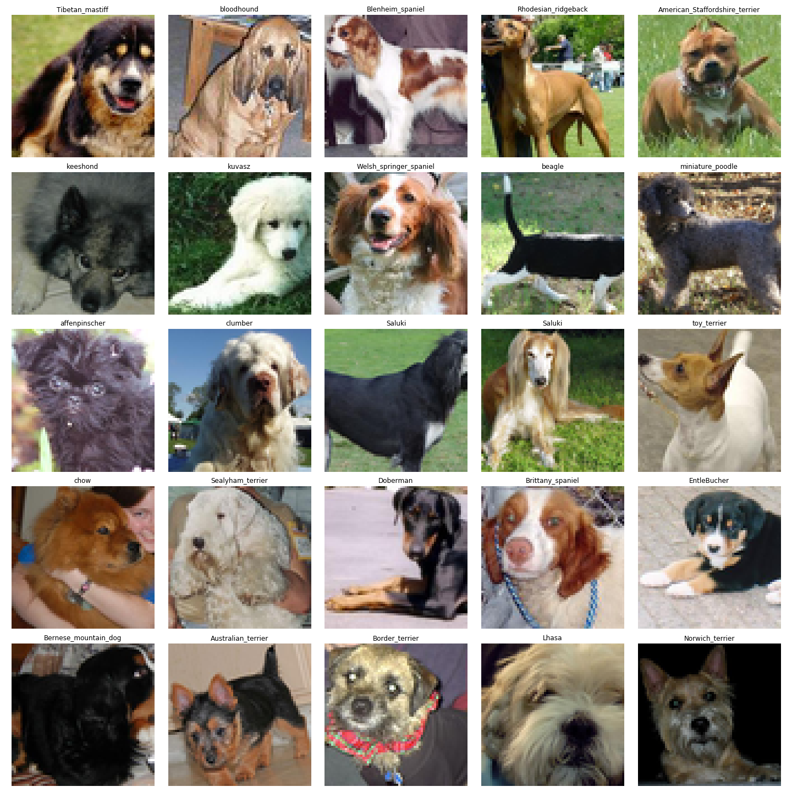
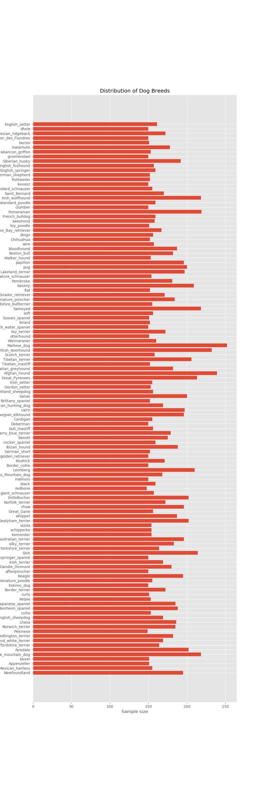
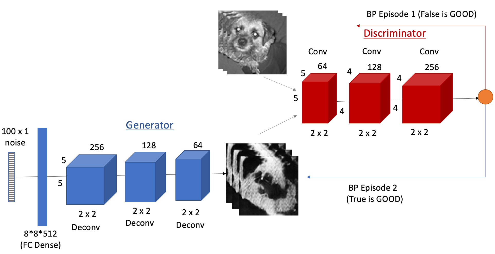
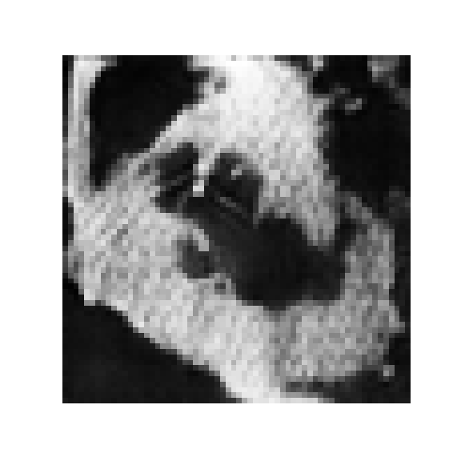

# Dog Image Generation using Generative Adversarial Network(GAN)

### Abstract

This capstone uses generative adversarial network (GAN) to generate realistic dog images from the training data. 

### Data

 

https://www.kaggle.com/c/generative-dog-images

### Exploratory Data Analysis

In total, there are 25,000 dogs and 120 breeds.

  

### Network Architecture

Here is the GAN network I used for this capstone. 

### Results

GAN is difficult to train. In interest of time, I break the problem into a simpler problem where I focused on grayscale images. Here training results I obtained: 

Here is the best dog image I was able to produce during the limited capstone time. 

### Summary

* GAN is hard to train as it requires an equilibrimum between two competing neural networks. The common problems are mode collapse and non-convergence. 

* Next, I will be exploring BigGAN based transfer learning to improve my dog images.

## References

* https://tfhub.dev/deepmind/biggan-128/2
* https://arxiv.org/abs/1701.00160

