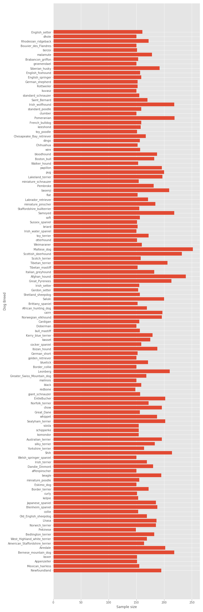

# oh-my-dog

### Abstract

This capstone uses generative adversarial network (GAN) to generate realistic dog images from the training data. 

### Objective

* Complete GAN model

How GAN works?

* generateor receives a random seed as input
* the seed is used to produce output
* discriminator then is used to classify real images (drawn from the training set) from fake images (produced by the generator)
* losses are calculated for each of the models
* gradients are used to update the generator and discriminator

### Data

 

https://www.kaggle.com/c/generative-dog-images

### Exploratory Data Analysis

In total, there are 25,000 dogs and 120 breeds.

  

### Network Architecture

### Results

### Conclusion
